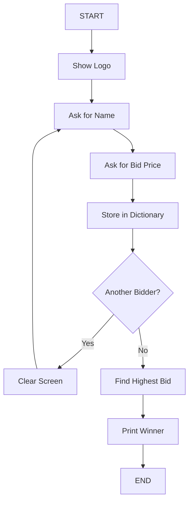

# Day 09 – Blind Auction Flowchart

---

## 1️⃣ Text-Based Flow Description

Program execution flow:

1. Start program
2. Show logo
3. Ask for bidder name
4. Ask for bid price
5. Store name and price in dictionary
6. Ask if there are more bidders
    - Yes → Clear screen → Continue loop
    - No → Find highest bid → Print winner

---

## 2️⃣ ASCII Flowchart

```
START
  |
  v
Show Logo
  |
  v
Ask for Name
  |
  v
Ask for Bid Price
  |
  v
Store Name + Price in Dictionary
  |
  v
Is there another bidder?
  |-----------------------|
  | Yes                   | No
  v                       v
Clear Screen          Find Highest Bid
  |                       |
  |                       v
  |                  Print Winner
  |                       |
  |-----------------------|
              |
              v
             END
```

---

## 3️⃣ Mermaid Flowchart (GitHub Supported)



---

## 4️⃣ Flow Logic Layers

This flowchart represents three logical layers:

### Input Layer
- Collect name
- Collect bid

### Storage Layer
- Store in dictionary

### Control Layer
- Boolean state controls loop
- Conditional branch decides execution path

---

## 5️⃣ Algorithm Mapping

The “Find Highest Bid” step corresponds to:

```python
for bidder in bids:
    if bids[bidder] > highest_bid:
        highest_bid = bids[bidder]
```

This is the max-tracking algorithm pattern.

---

## 6️⃣ Summary

This flowchart visualizes:

- Data flow
- Control flow
- Decision branches
- Loop structure

It transforms code logic into a visual system model.

---

# End of Flowchart
